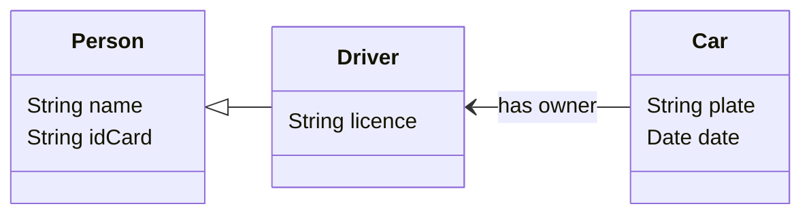

# Avilable Repositories

<!--
**catarinafoliveira/catarinafoliveira** is a ✨ _special_ ✨ repository because its `README.md` (this file) appears on your GitHub profile.

Here are some ideas to get you started:

- 🔭 I’m currently working on ...
- 🌱 I’m currently learning ...
- 👯 I’m looking to collaborate on ...
- 🤔 I’m looking for help with ...
- 💬 Ask me about ...
- 📫 How to reach me: ...
- 😄 Pronouns: ...
- :computer: Fun fact: ...
-->

## NodeJS APIs
* :computer:MyAPI (v1) 
:link:[repository](https://github.com/catarinafoliveira/myApi_v1): A REST API to interact with information regarding persons, drivers and their cars.

* :computer:MyAPI (v2) 
:link:[repository](https://github.com/catarinafoliveira/myApi_v2): A REST API to interact with information regarding persons, drivers and their cars.
Similar to [MyApi (v1)](https://github.com/catarinafoliveira/myApi_v1), but using classes and MVC.

* :computer:MyAPI (v3) 
:link:[repository](https://github.com/catarinafoliveira/myApi_v3): A REST API to interact with information regarding persons, drivers and their cars.
Similar to [MyApi (v1)](https://github.com/catarinafoliveira/myApi_v1), but using authentication and authorisation.

## Angular Applications (v18)
* :computer:MyFrontend (v1) 
:link:[repository](https://github.com/catarinafoliveira/AngularFrontend_v1): Frontend for [MyApi (v1)](https://github.com/catarinafoliveira/myApi_v1)

* :computer:MyFrontend (v3) 
:link:[repository](https://github.com/catarinafoliveira/AngularFrontend_v2): Frontend for [MyApi (v3)](https://github.com/catarinafoliveira/myApi_v3)

## Angular Applications (v19)
* :point_right: :computer:MyFrontend (v1) 
:link:[repository](https://github.com/catarinafoliveira/catarinafoliveira-myAngularV19Frontend_v1): Frontend for [MyApi (v1)](https://github.com/catarinafoliveira/myApi_v1)

## Vue Applications
* :computer:MyFrontend (v1) 
:link:[repository](https://github.com/catarinafoliveira/myFrontend_v1): Frontend for [MyApi (v1)](https://github.com/catarinafoliveira/myApi_v1)

* :computer:MyFrontend (v3)
:link:[repository](https://github.com/catarinafoliveira/myFrontend_v3): Frontend for [MyApi (v3)](https://github.com/catarinafoliveira/myApi_v3)
